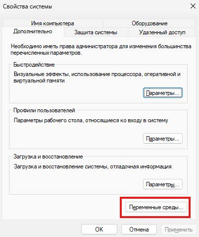
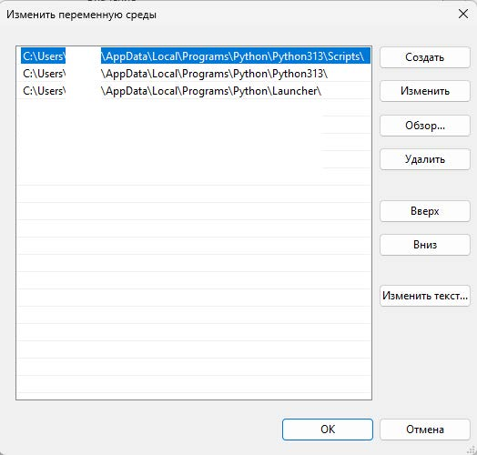

# Python-homework-1

Выполнение домашнего задания №1. Настройка рабочей среды.

## Содержание

- [Python-homework-1](#python-homework-1)
  - [Содержание](#содержание)
  - [1. Установка Python](#1-установка-python)
  - [2. Установка Jupyter Lab](#2-установка-jupyter-lab)
  - [3. Установка Make](#3-установка-make)
  - [4. Установка GIT](#4-установка-git)
  - [5. Установка Visual Studio Code](#5-установка-visual-studio-code)
  - [6. Установка PyCharm](#6-установка-pycharm)
  - [7. Пакетные менеджеры](#7-пакетные-менеджеры)
    - [7.1 PIP](#71-pip)
    - [7.2 Poetry](#72-poetry)
    - [7.3 UV](#73-uv)
  - [8. Виртуальное окружение](#8-виртуальное-окружение)
    - [8.1 Создание окружения с помощью PIP](#81-создание-окружения-с-помощью-pip)
    - [8.2 Создание окружения с помощью Poetry](#82-создание-окружения-с-помощью-poetry)
    - [8.3 Создание окружения с помощью UV](#83-создание-окружения-с-помощью-uv)
  - [9. Скрипты для работы с проектом](#9-скрипты-для-работы-с-проектом)
  - [9.1 Установка переменных оркужения](#91-установка-переменных-оркужения)
    - [9.2 Создание проекта с PIP](#92-создание-проекта-с-pip)
    - [9.3 Создание проекта с Poetry](#93-создание-проекта-с-poetry)
    - [9.4 Создание проекта с UV](#94-создание-проекта-с-uv)
    - [9.5 Коммит и пуш на github](#95-коммит-и-пуш-на-github)
  - [Полезные ссылки](#полезные-ссылки)

## 1. Установка Python

Скачивание по ссылке <https://www.python.org/downloads/windows/>

Добавление переменных среды PATH.
Поиск -> Переменные среды -> Path.





## 2. Установка Jupyter Lab

Jupyter Lab предоставляет графический интерфейс для работы с NoteBooks (формат .ipynb).

Установка Jupyter Lab

```sh
pip install --upgrade pip
pip install jupyterlab
```

Запуск Jupyter Lab

```sh
jupyter lab
```

После запуска интерфейс будет доступен по ссылке <http://localhost:8888/lab>.

## 3. Установка Make

Make — это инструмент автоматизации сборки (build automation tool). Он позваляет создавать команды в специальном файле — Makefile, где описано:

- какие задачи нужно выполнить,
- какие файлы или команды использовать,
- и в каком порядке.

Скачивание доступно по ссылке <https://sourceforge.net/projects/gnuwin32/files/make/3.81/>.

После установки необходимо добавить "GnuWin32\bin" в PATH переменных среды

Подробное руководство доступно по ссылке <https://makefiletutorial.com>.

## 4. Установка GIT

Скачивание доступно по ссылке <https://git-scm.com/install/windows>.

После установки необходимо добавить "Git\bin" в PATH переменных среды.

Файл .gitignore <https://github.com/github/gitignore>.

```sh
# Инициализация репозитория
git init
# Подключение удаленного репозитория
git remote add origin https://github.com/%GITHUB_USER%/%PROJ_NAME%.git
# Скачивание изменений с удаленного репозитория
git pull
# Клонирование репозитория в локальную папку
git clone https://github.com/%GITHUB_USER%/%PROJ_NAME%.git
# Добавление файла в контроль версий
git add --all
# Комитит изменения в локальный репозиторий
git commit -a -m "initial commit"
# Отправляет изменения в удаленный репозиторий
git push -u origin main
# Удаляет файл из контроля версий
git rm имя_файла_или_маска
# Перемещение файла в другой каталог
git mv dir1/имя_файла dir2
```

## 5. Установка Visual Studio Code

Скачивание доступно по ссылке <https://code.visualstudio.com/>.

В VSCode можно устанавливать плагины для упрощения работы с проектом. Список плагинов, которые могут быть полезны:

- Python
- Jupyter
- GitLens
- IntlliCode API Usage Examples
- GitHub Copilot Chat
- YAML
- Markdown All in One
- indent-rainbow
- markdownlint
- Better Comments
- Makefile Tools
- Error Lens
- Even Better TOML
- Python Environments
- Ruff
- IntelliCode Completions
- Rainbow Brackets
- autoDocstring

## 6. Установка PyCharm

Скачивание доступно по ссылке <https://www.jetbrains.com/pycharm/download/>.

Список плагинов, которые могут быть полезны:

- Better Highlights
- CSV Editor
- Developer Tools
- Indent Rainbow
- Inspection Lens
- Rainbow Brackets
- StringManipulation

## 7. Пакетные менеджеры

Пакетный менеджер — это программа, которая:

- устанавливает,
- обновляет,
- удаляет,
- и управляет зависимостями (библиотеками, модулями, фреймворками)
для твоего проекта или системы.

### 7.1 PIP

Начиная с версии Python 3.4, pip устанавливается автоматически вместе с самим Python.

Руководство по pip доступно по ссылке <https://pip.pypa.io/en/stable/cli/>.

```sh
# Установка пакета
pip install pytest
# Обновление пакета
pip install –-upgrade pytest
# Установка зависимостей по списку из файла
pip install –r requirements.txt
# Удаление пакета
pip uninstall pytest
# Запись установленных пакетов в файл
pip freeze
# Список установленных пакетов
pip list
# Вывод информации о пакете
pip show pytest
# Проверка пакета на совместимость
pip check pytest
# Поиск в репозитории по ключевым словам
pip search test
```

### 7.2 Poetry

Руководство по Poetry доступно по ссылке <https://python-poetry.org/docs/cli/>.

```sh
# Создание папки с проектом
poetry new имя_проекта –-name имя_пакета
# Установка пакета
poetry add pytest
# Обновление пакета
poetry add pytest –dev
# Обновление зависимости
poetry update pytest
# Установка зависимостей по списку из pyproject.toml
poetry install
# Удаление зависимости
poetry remove pytest
# Запись зависимостей с точными версиями в poetry.lock
poetry lock
# Список установленных зависимостей
poetry show –tree
# Проверка проекта на проблемы с зависимостями
poetry check
```

### 7.3 UV

Руководство по UV доступно по ссылке <https://docs.astral.sh/uv/reference/cli/>.

```sh
# Установка пакета
uv add pytest
# Обновление пакета
uv add --upgrade pytest
# Установка зависимостей из pyproject.toml /
# requirements.txt
uv sync
# Удаление пакета
uv remove pytest
# Список установленных пакетов
uv tree
# Запись зависимостей с точными версиями в uv.lock
uv lock
# Проверка зависимостей и lock-файла
uv check
```

## 8. Виртуальное окружение

Виртуальное окружение — изолированная среда для зависимостей конкретного проекта.

### 8.1 Создание окружения с помощью PIP

```sh
python -m venv venv
.venv\Scripts\activate
```

### 8.2 Создание окружения с помощью Poetry

```sh
poetry new myproject
poetry config virtualenvs.in-project true
poetry install
```

### 8.3 Создание окружения с помощью UV

```sh
uv venv
.venv\Scripts\activate [Win]
```

## 9. Скрипты для работы с проектом

## 9.1 Установка переменных оркужения

```sh
set PROJ_NAME=ИМЯ_ПРОЕКТА_НА_GITHUB
set GITHUB_USER= ИМЯ_ПОЛЬЗОВАТЕЛЯ_НА_GITHUB
```

### 9.2 Создание проекта с PIP

```sh
call env.cmd
md %PROJ_NAME%
cd %PROJ_NAME%
python -m venv .venv
call .venv\Scripts\activate.bat
md src
cd src
md %PROJ_NAME%
cd ..
call git_init.cmd
```

### 9.3 Создание проекта с Poetry

```sh
call env.cmd
python -m pip install poetry
poetry new --src %PROJ_NAME%
cd %PROJ_NAME%
poetry add --group dev ruff
poetry lock
call git_init.cmd
```

### 9.4 Создание проекта с UV

```sh
call env.cmd
python -m pip install uv
uv init %PROJ_NAME%
cd %PROJ_NAME%
uv venv
.venv\Scripts\activate
uv add --dev ruff
uv lock
call git_init.cmd
```

### 9.5 Коммит и пуш на github

```sh
call env.cmd
git init
git add --all
git commit -a -m "initial commit"
git remote add origin https://github.com/%GITHUB_USER%/%PROJ_NAME%.git
git push -u origin main
```

## Полезные ссылки

- [PEP 8 – Style Guide for Python Code](<https://peps.python.org/pep-0008/>)
- [PEP 8 - руководство по написанию кода на Python](<https://pythonworld.ru/osnovy/pep-8-rukovodstvo-po-napisaniyu-koda-na-python.html>)
- [PEP 8 - коротко о главном](<https://defpython.ru/pep8__korotko_o_glavnom>)
- [Markdown: Syntax](<https://daringfireball.net/projects/markdown/syntax>)
- [Шаблон README.md](<https://gist.github.com/bzvyagintsev/0c4adf4403d4261808d75f9576c814c2>)
- [SPHINX - Getting started](<https://www.sphinx-doc.org/en/master/usage/quickstart.html>)
- [An idiot’s guide to Python documentation with Sphinx and ReadTheDocs](<https://samnicholls.net/2016/06/15/how-to-sphinx-readthedocs/>)
